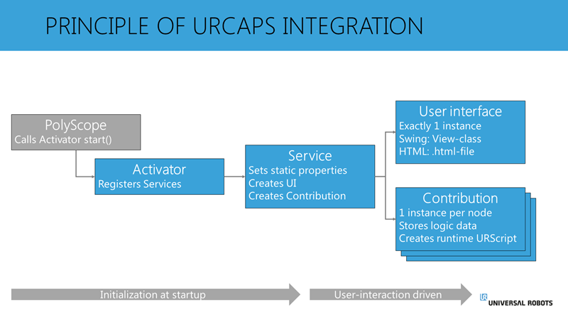

# URCaps 在PolyScope中的集成原理

本文概述了URCaps 如何集成到图形化编程接口PolyScope中的原理， 以及各种java类和接口如何交互。 

一个URCap是一个软件包， 他作为PolyScope的子程序运行。 因此，PolyScope将注册URCap，并以各种方式与URCap交互。 例如在启动PolyScope期间， 或者基于用户界面中的用户交互。

例如，一个夹爪的URCap可以包含安装节点的服务，用于配置夹爪的安装方式和通讯连接。这个URCap提供的另一个服务可以是一个程序节点，它可以用来打开夹持器，另一个类似的服务是另一个程序节点，但是用于关闭夹持器。第四个服务可以是一个工具栏，它允许对抓取器进行实时控制。
通过这种方式，一个URCap向PolyScope提供了4个服务;安装节点服务1个，程序节点服务2个，工具栏服务1个。

URCap如何集成到PolyScope中的一般原则如下图所示。

    当PolyScope启动时，它会查找任何已安装的URCaps。然后PolyScope在每个URCap中调用激活器（Activator），在激活器（Activator）中将注册应该对PolyScope可用的服务（Service）。

该激活器有两个overwritten 的方法; start() 和 stop ()。 当PolyScope启动时调用start() 方法，当PolyScope停止时调用stop() 方法。

被激活器注册的服务设置URCap的一些常规的属性， 如用户界面中显示的节点名。 该服务还提供一些方法，PolyScope使用这些方法分别创建用户界面(UI)（View class）和相应的贡献节点Contribution class。

一般来说，服务中提供的设置可以看作是静态的，因为它们不能在运行时进行更改，而只能在启动时调用。

当某个类型的服务被需要时，例如，一个程序节点，当用户将其插入程序时，PolyScope调用服务中的方法来创建该节点。这将创建一个用户界面（view） 和一个贡献(contribution)。

用户界面可以基于Java Swing实现，也可以基于HTML实现。在这两种情况下，需要注意的是，对于一个view class， 只有一个UI实例存在，不管实际程序节点的实例插入了多少。

用户界面包含在PolyScope布局中显示给用户的不同样式的可视化元素，当与UI交互时，这将尝试在对应的Contribution中更改设置。

Contribution是当前活跃节点的逻辑或控制代码。对于每一个在活跃在程序中的节点实例，都有一个新的Contribution实例。

该Contribution具有一个DataModel对象，该对象用于存储节点的配置。当用户在UI中执行操作时，UI将向活动贡献报告此操作，活动贡献将随后将此设置存储在DataModel中。当用户执行程序时，贡献负责根据数据模型的配置生成URScript。

当节点被创建时，用户与节点交互时，一般活动发生在View Class 和Contribution Calss之间。后面将详细说明这两个实体如何连接的原则。

## Examples

在下面的示例中，我们将重点介绍基于Java Swing的UI。UI的选择还会影响应该创建什么服务。

如果你分别创建了一个:

[Program Node](program.md)
[Installation Node](installation.md)
[ToolBar](URCap_inshort.md)