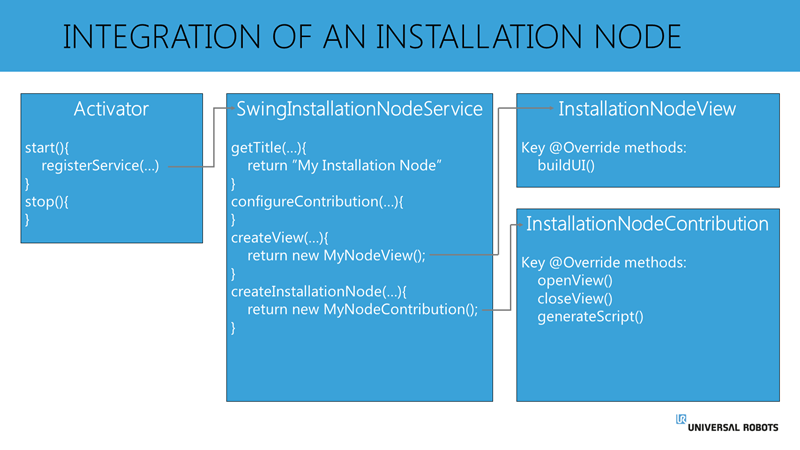

# Principle of URCaps Installation Node integration in PolyScope

在下面的图中，分别显示了服务、视图(UI)和贡献中所需的一些关键方法。



## 基于java swing 的安装设置节点 Service 

创建安装节点时，swinginstallationnodeservice接口规定，必须实现以下方法:

**getTitle ()**
参数:本地location
返回:字符串
何时调用:服务注册后调用一次

SwingInstallationNodeService中的gettitle方法应该返回InstallationNode的名称，它是一个静态名称，应该告诉用户这个节点用于什么。

系统的本地化作为一个参数提供，可用于返回本地化为系统语言的节点名。

Example:

```java
return “My Installation”;
```
**configureContribution()**
参数:ContributionConfiguration配置
返回:空白
何时调用:服务注册后调用一次

ContributionConfiguration表示这种安装节点的配置。
它是为将来使用而实现的，目前不提供任何选项。它应该保持空白。

**createView ()**
参数:ViewAPIProvider apiProvider
返回:V (SwingInstallationNodeView的通用类型)
调用时间:服务注册后调用一次
虽然一个程序节点可能同时存在于多个实例中，但是SwingInstallationNodeView和InstallationNodeContribution之间的关系总是1:1。同时只有一个视图实例和一个贡献实例。
由于安装节点始终是加载的安装的一部分，所以在服务注册后不久就会调用createView()-方法。这个方法调用应该返回View-class的一个新实例。ViewAPIProvider作为一个参数给出。ViewAPIProvider通常会被转发到view类，这是在文本字段上创建键盘所必需的。
ViewAPIProvider还可用于获取SystemAPI，该api可用于检查机器人的软件版本。根据URCap是安装在e系列机器人(PolyScope 5.x+)还是安装在CB3机器人(PolyScope 3.3+)上，这对于创建版本化的用户体验非常有用。

Example:

```java
return new MyInstallationNodeView(apiProvider);
```

**createInstallationNode ()**
参数:InstallationAPIProvider apiProvider, V view, DataModel model，CreationContext context
返回:C (InstallationNodeContribution的通用类型)
何时调用:当PolyScope启动时自动创建节点，或者当安装切换时(通过创建新节点或加载现有节点)

方法应该返回贡献的一个新实例。虽然视图只有一个实例，但是当切换机器人上的安装时，可以创建安装节点贡献的一个新实例。如果创建了新的安装，或者加载了现有的安装文件，就会发生这种情况。
根据经验，这些参数应该转发给贡献类，供其使用。
InstallationAPIProvider提供对与安装节点相关的PolyScope API的贡献访问。v参数是createView()-方法返回的对象，允许Contribuiton与View交互。
DataModel是Contribution可以使用的，用来存储由用户完成的节点的设置和配置。如果节点是新插入的，数据模型将是空的，但是如果节点是加载的(例如作为安装文件的一部分)，数据模型可能已经包含了节点的配置数据。
Contribution可以使用CreationContext来检查自身的创建是否是新插入节点的结果，或者是否加载了节点。

## Swing安装节点视图

SwingInstallationNodeView-interface规定视图类必须实现以下方法:

buildUI ()
参数:JPanel panel, C contribution (InstallationNodeContribution的通用类型)
返回:空白
调用时间:服务注册后调用一次

创建视图时，调用buildUI()-方法。该方法提供一个JPanel作为参数。这个JPanel是将在PolyScope中显示给用户的面板。JPanel已经获得了PolyScope中可用的实际空间的大小，在buildUI()调用期间，应该用希望显示给用户的UI元素填充此面板。在返回此调用时，所提供的JPanel将显示给用户。
InstallationNodeContribution的加载实例作为一个参数提供，当用户在UI中执行操作时，视图类可以使用这个参数与贡献进行交互。

## Installation Node Contribution

installationnodecontribu-接口指定了许多要实现的方法。值得注意的一点是，无论UI是基于Swing还是基于HTML, installationnodecontribu- interface都是不变的，但是与这两种实现交互的方式可能有所不同。

**openView ()**
参数:空白
返回:空白
调用when:每当用户进入此特定节点的用户界面时
应该使用openView()-方法用节点的活动设置填充用户界面。通常，这个调用可用于读取DataModel中的活动值，并将这些值更新为UI中的活动值。
这个方法也可以用来启动一个定时器，只要这个节点在焦点上，它就会动态地更新UI中的值。

**closeView ()**
参数:空白
返回:空白
调用when:每当用户离开此特定节点的用户界面时
对closeView()的调用通知贡献，用户现在不再查看此节点。
如果在openView()中启动了计时器或其他正在运行的任务，现在是再次停止这些任务的时候了。

**generateScript ()**
参数:ScriptWriter writer
返回:空白
调用时间:通常在程序启动或保存时调用
当安装节点向整个程序提供URScript时，这将在添加程序节点逻辑和URScript之前用作序言。
这使得安装节点对于初始化值或设置或定义程序节点稍后在程序中使用的函数非常有用。
通常，生成的脚本应该只依赖于来自DataModel或静态值的设置。
脚本应该使用scriptwritter-object创建。例如，在写剧本的人后面加上“writer”。或者使用自定义URScript调用“writer”。分配(“myVariable”、“42”)”。

有关URScript的语法，请参阅URScript手册。
