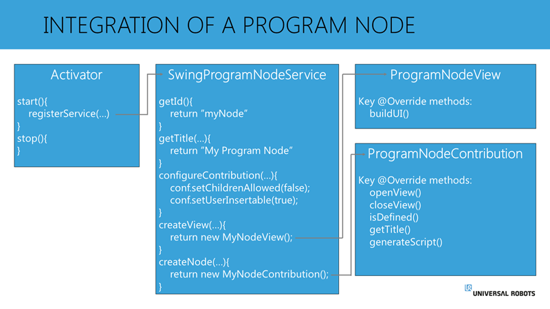

# Principle of URCaps Program Node integration in PolyScope

在下面的图中，分别显示了服务(Service)、视图(View)和贡献(Contribution)中所需的一些关键方法。



## 基于Java Swing 的程序节点中的Service

对于基于Java Swing的程序节点，接口SwingProgramNodeService必须被使用。
SwingProgramNodeService接口规定，必须实现以下方法:

**getId ()**
参数:空白
返回:字符串
调用时间:服务注册后一次

getId()方法为这种节点返回一个惟一的ID。当存在多个程序节点时，这用于标识哪些程序节点属于同一类型。

Example:
`return “myNodeType”;`

**configureContribution()**
参数:ContributionConfiguration配置
返回:空白
调用时间:服务注册后一次

ContributionConfiguration()方法表示改节点的配置。ContributionConfiguration-object可以改变,通过调用相关方法, 如：
参数|描述|默认值
---|:--:|---:
setChildrenAllowed|这个节点是否允许有子节点|false
setUserInsertable |是否允许用户插入节点|true
setDeprecated | 是否被允许再次插入（只在URCap内部可用，适用于模板） | false

Example:

```java
configuration.setChildrenAllowed(false);
configuration.setUserInsertable(false);
configureation.setDeprecated(false);
```

**getTitle()**
参数:Locate
返回:字符串
调用时间:服务注册后一次
SwingProgramNodeService中的gettitle方法应该返回程序节点的名称，如结构-概览所示。它是一个静态名称，应该告诉用户这个节点用于什么。
系统的本地化作为一个参数提供，可用于返回本地化为系统语言的节点名。

```java
Example: 
if(“de”.equals(locale.getLanguage())) {
   return “Greifer Öffnen”;
} else {
   return “Gripper Open”;
}
```

**createView()**
参数:ViewAPIProvider apiProvider
返回:V (SwingProgramNodeView的泛型类型)
调用时间: 只有一次，用户第一次插入或加载此类节点到程序中

只有在第一次使用节点时才调用createView()-方法。这个方法调用应该返回View-class的一个新实例。ViewAPIProvider作为一个参数给出。ViewAPIProvider通常会被转发到view class中使用，例如在一个文本框中调用一个键盘。

ViewAPIProvider还可用于获取SystemAPI，该api可用于检查机器人的软件版本。根据URCap是安装在e系列机器人(PolyScope 5.x+)还是安装在CB3机器人(PolyScope 3.3+)上，这对于创建针对不同版本的UI，给不同版本型号机器人使用者提供更好的用户体验非常有用。

Example:

``` java
return new MyProgramNodeView(apiProvider);
```

**createNode()**
参数:ProgramAPIProvider apiProvider, V View，DataModel model,，CreationContext context
返回:C (ProgramNodeContribution的通用类型)
何时调用:每当创建这种类型的节点时，无论是由插入新节点的用户创建，还是通过加载包含这种类型节点的程序创建，或者由另一个URCap插入程序创建

该方法返回一个新的Contribution 的实例。 虽然视图只有一个单独的实例，但是每次需要一个新节点时，都会有一个新的贡献实例。

通常，这些参数应该转发给贡献类，供其使用。

参数 **ProgramAPIProvider** 提供对与程序节点相关的PolyScope API的Contribution访问。参数**V**是createView()-方法返回的对象，使得Contribution与View交互。

参数**DataModel**是Contribution可以使用的，用来存储由用户完成的节点的设置和配置。如果节点是新插入的，数据模型将是空的，但是如果节点是加载的(例如作为程序的一部分)，数据模型可能已经包含了节点的配置数据。

贡献可以使用**CreationContext**来检查自身的创建是否是新插入节点的结果，或者是否是被加载的节点。

Example:

```java
return new MyProgramNodeContribution(apiProvider, view, model, context);
```

## 基于Java Swing 的程序节点的View Class

接口SwingProgramNodeView 规定view class 必须实现以下的方法:

**buildUI()**
参数:JPanel panel, ContributionProvider<C> provider
返回:空白
何时调用: 只有一次，这是用户第一次插入或加载此类节点到程序中

创建视图时，调用buildUI()-方法。该方法提供一个JPanel作为参数。这个JPanel是将在PolyScope中显示给用户的面板。JPanel已经获得了PolyScope中可用的实际空间的大小，在buildUI()调用期间，应该用希望显示给用户的UI元素填充此面板。在返回此调用时，所提供的JPanel将显示给用户。
另一个参数是ContributionProvider。由于Contribution可以有多个实例，但是只有一个视图实例，所以当用户与节点交互时，ContributionProvider将提供对活跃的Contribution的访问。
调用“provider.get()”将返回活动的ProgramNodeContribution的实例。

## 程序节点的Contribution class

每当用户插入新节点或加载现有节点时，都会返回ProgramNodeContribution的新实例。接口programnodecontribu指定了许多要实现的方法。值得注意的一点是，无论UI是基于Swing还是基于HTML, programnodecontribu- interface都是不变的，但是与这两种实现交互的方式可能不同。

**openView()**
参数:空白
返回:空白
调用when:每当用户进入此特定节点的用户界面时

由于只有一个用户界面实例，但是ProgramNodeContribution可能有多个实例，所以应该使用openView()-方法用这个节点的特定设置填充用户界面。
通常，这个调用可用于读取DataModel中的活动值，并将这些值更新为UI中的活动值。
这个方法也可以用来启动一个定时器，只要这个节点在焦点上，它就会动态地更新UI中的值。

**closeView()**
参数:空白
返回:空白
调用when:每当用户离开此特定节点的用户界面时

对closeView()的调用通知贡献，用户现在不再查看此节点。
如果在openView()中启动了计时器或其他正在运行的任务，现在是再次停止这些任务的时候了。
